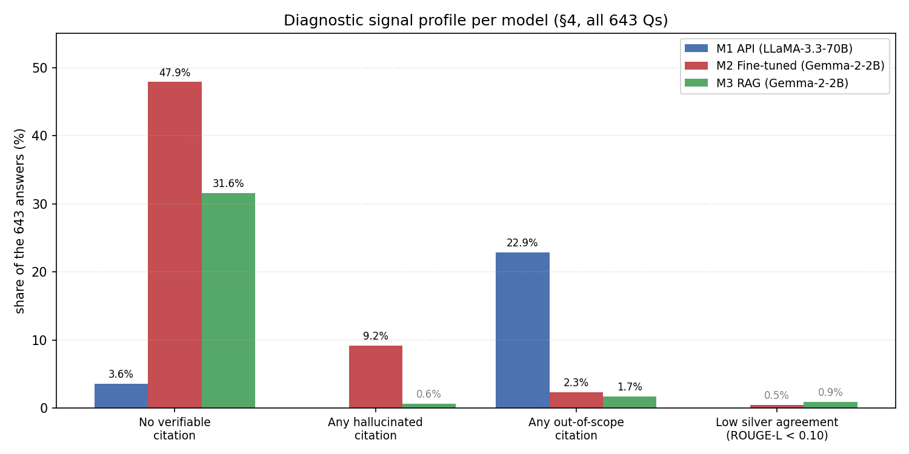

# Team 11 — Stage 3 Report
## Austrian Tax Law Q&A with Three LLM Approaches

**Course:** WU Wien 4805 Applications of Data Science — LLMs (SS26)
**Team:** Team 11 — Berkay Kaya
**Task:** Answer 643 Austrian tax-law questions in German using three different LLM setups (one with API, two without).
**Dataset:** `dataset_clean.csv` (643 questions, columns `id`, `prompt`).

> **Scope note.** No verified gold answers exist for this dataset. The
> evaluation is built from two complementary methods, both covering all 643
> questions:
> (1) **Proxy similarity** — ROUGE / BLEU of each model against Model 1
> (LLaMA-3.3-70B) as a silver reference.
> (2) **Citation validity** — a systematic existence check that parses every
> `§ X … <lawname>` pair from all 1 929 answers and verifies the § number
> against the indexed law PDFs. This method requires no reference model.
> Both methods independently yield the same model ranking (M1 > M3 > M2),
> which is the strongest claim available without human annotation.

---

## 1. Models

| # | Name | Approach | Base model | Size | Inference runtime |
|---|------|----------|------------|------|-------------------|
| 1 | **API** | Zero-shot prompting via Groq API | `llama-3.3-70b-versatile` (Meta LLaMA-3.3) | 70 B params | local Mac (~32 min) |
| 2 | **Fine-tuned** | QLoRA supervised fine-tuning | `google/gemma-2-2b-it` | 2 B params | Kaggle T4 |
| 3 | **RAG** | Retrieval-augmented generation | `google/gemma-2-2b-it` + FAISS retriever | 2 B params | Kaggle T4 |

### 1.1 Model 1 — API (LLaMA-3.3-70B via Groq)
- **Pre-training data:** Meta's LLaMA-3 line, pre-trained on a multilingual web / books / code mix (see the official Meta model card; we did not audit this ourselves). No domain specialisation for Austrian tax law.
- **Hyper-parameters at inference:** `temperature=0.1`, `max_tokens=300`, zero-shot, German "legal expert" system prompt requiring citations like `(§ 7 Abs. 1 KStG)`.
- **Sampling approach:** near-greedy (low temperature), no top-p or top-k overrides.
- **Engineering:** 3-attempt retry, `sleep(0.3)` between calls, checkpoint every 50 questions.

### 1.2 Model 2 — Fine-tuned (Gemma-2-2B QLoRA)
- **Base model:** `google/gemma-2-2b-it`, instruction-tuned 2 B-parameter decoder (see official Google / Gemma model card for training composition).
- **Fine-tuning data — rule-based pipeline, no API data:**
  1. Extract text from the three law PDFs (EStG, KStG 1988, UStG) and split on `§` markers → **3 643 raw sections** (EStG ≈ 2 550, KStG ≈ 580, UStG ≈ 513).
  2. Skip sections shorter than 50 chars; truncate at 2 000 chars.
  3. Apply **10 German instruction/answer template pairs**. For each surviving section, pick `min(3, len(TEMPLATES)) = 3` templates at random (seed 42) → candidate pool of ~10 900 pairs.
  4. Shuffle and trim to **400 pairs** (`max_pairs=400`). The final 400 pairs are a sparse random sample of the law — estimated ~380–390 distinct sections, each contributing only one pair.
- **No manual filtering.** Only automated length filters; the 400 pairs are noisy verbatim slices of the law.
- **Fine-tuning method:** QLoRA (4-bit NF4) + LoRA adapters via `trl.SFTTrainer`.
- **LoRA config:** `r=16`, `alpha=32`, `dropout=0.05`, `target_modules=["q_proj","v_proj"]`.
- **Training:** 3 epochs, lr `2e-4`, per-device batch 4, gradient accumulation 4 → **effective batch 16**, `bf16=True`, single GPU (Kaggle T4).
- **Inference:** greedy decoding (`do_sample=False`), `repetition_penalty=1.15`, `max_new_tokens=300`, checkpoint every 50 questions.

### 1.3 Model 3 — RAG (Gemma-2-2B + FAISS)
- **Retriever:** `sentence-transformers/paraphrase-multilingual-mpnet-base-v2` (768-dim). FAISS `IndexFlatIP` with L2-normalised embeddings → **cosine similarity**.
- **Indexed documents:** `EStG.pdf`, `KStG 1988 Fassung vom 03.04.2026.pdf`, `UStG.pdf`.
- **Chunking:** PyMuPDF (`fitz`), split on `§` markers, max ~2 000 chars, metadata `{law, section, text}`.
- **Keyword pre-filter:** `detect_law(question)` boosts chunks from the law mentioned in the question.
- **Top-k:** 5 retrieved passages per question.
- **Generator:** `gemma-2-2b-it` 4-bit NF4, greedy decoding (`do_sample=False`), `repetition_penalty=1.15`, `max_new_tokens=300`.
- **Retrieval validation:** sanity-checked on the first 20 questions before the full run.

> **Corpus gap.** The 643 questions reference laws beyond what the RAG index
> covers (GrEStG, EStR 2000, ABGB, GewO). Only EStG, KStG, UStG are indexed.
> Model 3 is structurally disadvantaged on questions whose authoritative source
> lies outside those three files — see §4.4.

---

## 2. Evaluation setup

### 2.1 No verified reference answers
The task has no reference answers. A course-shared EStG-§23 file
(`Austrian Tax Law Dataset - EStG-23.csv`) exists, but its answers are
LLM-generated (identifiable via `student_id` in the file) — no more
authoritative than our own model outputs. We therefore do not treat it as a
gold reference. Instead, Model 1 is used only as a silver reference for proxy
similarity, complemented by a reference-free citation validity check across
all 643 questions.

> **Relation to the Stage-3 brief.** The course slides mention
> annotation-based accuracy as an example for Stage 3. A proper annotated
> evaluation was not possible: no verified expert answers exist and the shared
> annotation round did not take place. The two-method approach below is a
> transparent workaround. Its limits are documented explicitly in §4.7.

### 2.2 Metrics
- **ROUGE-1 / ROUGE-2 / ROUGE-L** (F-measure) via `rouge_score`.
- **BLEU** via `sacrebleu` (`tokenize="intl"`, corpus-level, 0–100 scale). Directional — pairwise table reports symmetric mean plus both raw directions.
- **Intrinsic:** avg answer length (chars, words); avg `§` count per answer; share of answers with at least one `§`. Crude — counts the symbol, does **not** verify the cited norm.
- **BERTScore** planned but blocked by missing `torch` wheel (Python 3.13 x86_64). Snippet in `evaluation.py` (`BERTSCORE_NOTE`) for Colab/Kaggle rerun.

### 2.3 Evaluation pipeline

| Stage | Script | Feeds | Outputs |
|---|---|---|---|
| 1 — proxy evaluation, all 643 Qs | `evaluation.py` | §3 + §4 ranking | `evaluation_main_table.csv`, `evaluation_pairwise.csv`, `evaluation_per_question.csv`, `evaluation_error_analysis.md` |
| 2 — citation validity, all 643 Qs | `citation_check.py` | §4.2 | `citation_check_summary.csv`, `citation_check_per_answer.csv` |
| 3 — figures | `visualize_results.py` | §3, §4 | `fig_main_results.png`, `fig_citation_validity.png`, `fig_diagnostic_profile.png` |

```bash
cd Berkay_Kaya/codes
python3 run_all_evaluations.py   # runs all three stages in order
```

### 2.4 Three layers of citation checking

| Layer | What it checks | Where |
|---|---|---|
| 1 — `§`-count | Does a `§` character appear? | §3.1 surface metric |
| 2 — existence check | Does `§ X <law>` actually exist in that law's PDF? | §4.2 (automated, all 643) |
| 3 — semantic correctness | Is the cited `§` the *right* norm for the question? | §4.3 (anecdotal — requires human annotation) |

---

## 3. Results

### 3.1 Main result table (prediction = row, reference = Model 1)

| Model | ROUGE-1 | ROUGE-2 | ROUGE-L | BLEU | Avg chars | Avg words | §/answer | % with § |
|---|---|---|---|---|---|---|---|---|
| Model 1 — API (LLaMA-3.3-70B) | 1.000 | 1.000 | 1.000 | 100.00 | 883 | 126 | 3.21 | 100.0 % |
| Model 2 — Fine-tuned (Gemma-2-2B) | **0.348** | **0.108** | 0.184 | 5.99 | 1257 | 163 | 1.28 | 57.4 % |
| Model 3 — RAG (Gemma-2-2B) | 0.317 | 0.105 | **0.186** | **7.88** | 779 | 105 | **2.35** | **94.1 %** |

Model 1 scores 1.0 by definition (it is the reference). The meaningful comparison is **Model 2 vs Model 3**.

*Note:* `§/answer` and `% with §` are the surface `§`-count (layer 1, §2.4). The stricter existence check is in §4.2.


### 3.2 Symmetric pairwise similarity (no reference privileged)

| Model A | Model B | ROUGE-1 | ROUGE-2 | ROUGE-L | BLEU mean | BLEU A→B | BLEU B→A |
|---|---|---|---|---|---|---|---|
| M1 API | M2 Fine-tuned | 0.348 | 0.108 | 0.184 | 5.71 | 5.43 | 5.99 |
| M1 API | M3 RAG | 0.317 | 0.105 | 0.186 | 7.88 | 7.88 | 7.88 |
| M2 Fine-tuned | M3 RAG | 0.333 | 0.104 | 0.179 | **10.95** | 11.49 | 10.42 |

The two Gemma-based models agree with each other (BLEU 10.95) more than either agrees with the LLaMA model — expected, since they share the same base model and vocabulary.

---

## 4. Error analysis

We ranked the 643 questions by mean `(ROUGE-L M2 vs M1, ROUGE-L M3 vs M1)` and inspected the 10 lowest-agreement questions. Full dump: `results/evaluation_error_analysis.md`. Important framing: "low agreement to M1" ≠ "wrong" — it is disagreement with the silver only.

### 4.1 Direct yes/no disagreements
- **`SELF-077` — "Sind Trinkgelder steuerpflichtig?"** — M1 and M2 say *ja*, M3 says *nein*. M3 is the only one that flips the direction and would mislead a practitioner.
- **`EMP-005` — freiwillige Abgangsentschädigung** — all three agree (*steuerpflichtig*) but cite wildly different paragraphs.

### 4.2 Citation hallucination — systematic count (all 643 questions)

Built a paragraph index from the three PDFs (EStG → 257 distinct §, KStG → 79, UStG → 58) and parsed every `§ X … <lawname>` citation from all 1 929 answers. Each citation is classified as:

- **grounded** — § number exists in the cited law's PDF,
- **hallucinated** — § number does NOT exist in the cited law's PDF,
- **out_of_scope** — cited law not indexed (ABGB, GewO, GrEStG, BAO, …).

```bash
python3 citation_check.py
```

| Model | Answers with ≥ 1 cite | § parsed | Grounded | Hallucinated | Out-of-scope | Grounded rate |
|---|---:|---:|---:|---:|---:|---:|
| Model 1 — API | 96.4 % (620/643) | 1 900 | 1 551 | **0** | 349 | **100.0 %** |
| Model 3 — RAG | 68.4 % (440/643) | 962 | 946 | **4** | 12 | **99.6 %** |
| Model 2 — Fine-tuned | 52.1 % (335/643) | 737 | 625 | **82** | 30 | 88.4 % |

**Interpretation.** Model 2 produces **82 hallucinated § numbers** (12 % of verifiable citations). Model 3 makes this mistake 4 times; Model 1 zero times. Model 3 lifts the § from the retrieved PDF chunk — as long as retrieval returns a real chunk, the § is real. Model 2 learned the *shape* of a citation but not *which* numbers exist. Model 1's 349 out-of-scope citations reference real but unindexed statutes (ABGB, GrEStG, …); the 100 % grounded rate is conditional on index coverage.

**What this check does NOT catch:** existence ≠ relevance. `§ 81 EStG` exists but is not the right norm for an *Einkommen aus nichtselbständiger Arbeit* question. Misattributions require human annotation (§4.3).

**Regex note:** we parse `§ X … <lawname>` within 80 chars. A `§` without a law name is not counted — so the 68 % "answers with cite" here is stricter than the 94 % surface number in §3.1.


### 4.3 Citation hallucination — specific examples
§ numbers that exist but are attached to the wrong topic (misattribution):

- **`TAX-INTL-031`** — M3 cites `§ 57 Abs. 4 BAd` (no such Austrian norm found).
- **`EStG-23-036`** — M3 cites `§ 81 EStG` for *Einkommen aus nichtselbständiger Arbeit*; correct norm is `§ 25 EStG`. (§ 81 EStG exists — §4.2 misses it.)
- **`EStG-23-038`** — M3 cites `§ 2 UStG` for a Gewerbebetrieb question; `§ 2 UStG` defines *Unternehmer* (VAT), not *Gewerbebetrieb*.
- **`GRESt-AT-035`** — M2 cites `§ 10 Abs. 2 EStG` for a GrEStG question — wrong statute entirely.

### 4.4 Out-of-corpus questions (RAG structural limit)
- **`SELF-047` — "Was ist ein Dienstvertrag gemäß ABGB § 1151?"** — M3 replies *"Der Text enthält keine Informationen…"*. Not a bug — a direct consequence of the corpus gap. The ABGB is not indexed.

### 4.5 Verbosity / padding (Fine-tuned only)
Model 2 averages 1 257 chars vs. 883 for Model 1. The extra content is mostly generic framing (*"Als Experte für österreichisches Steuerrecht…"*). It hurts BLEU and ROUGE-L (phrase-order sensitive) but inflates ROUGE-1 (unigram pool).

### 4.6 Shared mistake patterns
Both small models struggle on: multi-paragraph legal reasoning, questions pointing at the wrong law surface-form, and out-of-corpus questions. Style differs: Model 2 hedges and pads; Model 3 confidently emits a `§` even when retrieval misfires.

### 4.7 Diagnostic signal profile

The figure below summarises four deterministic diagnostic signals per model as a share of all 643 answers. All values are computed directly from the Stage 1–2 CSV outputs (no hand-labelling).



### 4.8 Honest caveats
- **No verified reference answers.** §3 numbers = similarity to M1, not legal correctness. A course-shared EStG-§23 file exists but contains LLM-generated answers — not used as a reference.
- **Surface metrics.** ROUGE/BLEU are lexical; legally equivalent but differently phrased answers score badly.
- **Citation check = existence only.** §4.2 checks that the § exists in the law, not that it is correct for the question.
- **BLEU is directional.** Pairwise table reports symmetric mean plus raw directions.
- **RAG corpus gap.** GrEStG, ABGB, BAO, GewO not indexed; those questions are structurally hard for Model 3.
- **Error-analysis ranking ≠ labelling.** Top-10 = lowest agreement with M1, not confirmed wrong answers.

---

## 5. Which model performs best?

Model 1 is the silver reference and not fairly comparable to the others. The relevant question is:

> **Among the two locally-hostable 2 B approaches, which is stronger?**

**Model 3 (RAG) is the stronger of the two**, on every meaningful metric:

- Highest BLEU vs. silver (7.88 vs. 5.99) and marginally higher ROUGE-L.
- 94 % of answers contain at least one `§` vs. 57 % for Model 2 (surface count).
- Average length 779 chars — closest to Model 1's 883; Model 2 is 42 % longer (padding).
- Model 2 leads only on ROUGE-1 — a mechanical verbosity effect, not quality.
- §4.2 confirms: Model 3 has 4 hallucinated §-numbers; Model 2 has 82 (9.2 % of its answers).

> **This does not imply Model 3 produces *correct* legal answers.** It means
> Model 3 sounds closer to Model 1 and cites real paragraphs more reliably.
> Semantic correctness of citations still requires human annotation.

---

## 6. Files in this submission

```
Berkay_Kaya/
├── REPORT_v2.md                        ← this file
├── codes/
│   ├── model1_api_inference.ipynb      (Stage 2 — unchanged)
│   ├── model2_finetune.ipynb           (Stage 2 — unchanged)
│   ├── model3_rag.ipynb                (Stage 2 — unchanged)
│   ├── evaluation.py                   ← proxy evaluation (§3)
│   ├── citation_check.py               ← citation validity (§4.2)
│   ├── visualize_results.py            ← figures (§3, §4)
│   └── run_all_evaluations.py          ← orchestrator (runs all 3 scripts)
└── results/
    ├── model1_api_results.csv          (Stage 2)
    ├── model2_finetuned_results.csv    (Stage 2)
    ├── model3_rag_results.csv          (Stage 2)
    ├── evaluation_main_table.csv       ← §3.1
    ├── evaluation_pairwise.csv         ← §3.2
    ├── evaluation_per_question.csv     ← §3 / §4 ranking input
    ├── evaluation_error_analysis.md    ← §4.1 / §4.3
    ├── citation_check_summary.csv      ← §4.2
    ├── citation_check_per_answer.csv   ← §4.2
    └── visualizations/
        ├── fig_main_results.png        ← §3.1
        ├── fig_citation_validity.png   ← §4.2
        └── fig_diagnostic_profile.png  ← §4 summary
```
